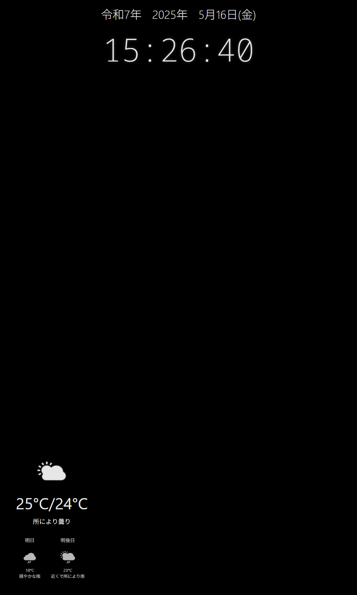

# Smart Mirror (Raspberry Pi Zero 2 W Edition)

A lightweight HTML/CSS/JS-based smart mirror UI for Raspberry Pi Zero 2 W.   
Displays clock, weather, and optionally controls display power using a motion sensor.  
While many smart mirror projects use Raspberry Pi 4/5, this project specifically targets the more affordable Raspberry Pi Zero 2 W.  
The Pi 4/5 would be overkill and unnecessarily expensive for a smart mirror application.  
The compact size of the Zero 2 W makes it perfect for concealing behind the mirror.
Due to the limited CPU and memory resources, special consideration has been given to using lightweight tools and avoiding heavy browsers like Chromium.  
The project is built primarily with vanilla JS, HTML, and CSS, deliberately avoiding heavy frameworks. Python is used only for the HTTP server and motion sensor control.  

Raspberry Pi Zero 2 W 用の軽量HTML/CSS/JS製スマートミラーUIです。時刻や天気を表示し、人感センサーと連動させることも可能です。  
主に日本国内の日本語話者向けに書いていますが少しカスタムすればどこの国の方でも使って頂けると思います。  

世間ではraspberry pi 4/5を使ったスマートミラーの情報が多くありますが、私のように安価なRaspberry Pi Zero 2 Wを使いたい方もいると思います。(ラズパイ4/5だとsmart mirror用途では少しオーバースペックすぎるし、高すぎる)  
小さいのでミラー裏にうまく仕込むにも適しています。  

ただし、chromium等重いブラウザを使うにはメモリもCPUも貧弱なので可能な限り軽量なツールを使う用に工夫しました。

プログラムは主にjs + html + cssを使って書いています。  
重いフレームワーク等は使わずプレーンなコードを心掛けました。  
pythonはhttpサーバーと人感センサーの制御に使用しています。



## Repository / リポジトリ

```bash
# Using HTTPS
git clone https://github.com/snklab77/smartMirror.git

# Using SSH / SSHを使用する場合
git clone git@github.com:snklab77/smartMirror.git
```

## Features / 機能

- Clock display (clock.js)
- Weather information (weather.js + WeatherAPI.com)
- Motion sensor-controlled display power (sensor.js)
- Black background + minimal UI

## Requirements / 必要なもの

- Raspberry Pi Zero 2 W
- Raspberry Pi OS Lite (32bit)
- Node.js
- WeatherAPI.com API key
- Python 3.x
- GPIO-related packages (gpiozero)
- luakit (for web browser)

## Installation / インストール

1. Clone the repository:
```bash
git clone https://github.com/snklab77/smartMirror.git
cd smartMirror
```

2. Install dependencies:
```bash
npm install

sudo apt install python3-gpiozero -y
sudo apt install python3-psutil -y
```

3. Configure environment:
Copy `example.env-config.js` to `env-config.js` and edit:
```javascript
const ENV = {
  WEATHERAPI_KEY: "YOUR-API-KEY-HERE",  // WeatherAPI.comから取得したAPIキー
  LOCATION: {
    lat: 35.681143654455774,  // Installation location latitude / 設置場所の緯度
    lon: 139.76749021382773,  // Installation location longitude / 設置場所の経度
    name: "品川区"  // Location name (optional) / 地域名（任意）
  }
};
```
今回天気予報APIはWeatherAPI.comを使用しています。  
APIキーは[こちら](https://www.weatherapi.com/)から取得してください。

Get your WeatherAPI.com API key from [here](https://www.weatherapi.com/).

4. Set up Python scripts:
```bash
# Copy scripts and make them executable / スクリプトをコピーして実行権限を付与
sudo chmod +x /usr/local/bin/motion_screen_control.py
sudo chmod +x /usr/local/bin/smartmirror_server.py
```

5. set up luakit:  
Install luakit and configration / luakit browserのインストールとconf設定

```bash
sudo apt-get install luakit
mkdir -p ~/.config/luakit
cp -r /etc/xdg/luakit/* ~/.config/luakit/
sudo vi ~/.config/luakit/rc.lua
```
`~/.config/luakit/rc.lua`

```ini
-- last line add / 最終行に追加

require "window"

-- 起動時に自動でフルスクリーン化
window.init_funcs = {
    function(w)
        w.fullscreen = true
        w.toolbar.visible = false
        w.tabbar.visible = false
        w.sbar.visible = false
        w.infobar.visible = false
    end
```

## Setup Guide / セットアップガイド

### 1. Boot Configuration
Add to `/boot/firmware/config.txt`:
```ini
# Enable DRM VC4 V3D driver
# dtoverlay=vc4-kms-v3d # If a KMS version is already written, comment it out and add the FKMS version/ 元々kms版が書かれていたらコメントアウトしてfkms版を追記
dtoverlay=vc4-fkms-v3d
```

### 2. X Configuration
Configure `~/.xinitrc`:
```sh
#!/bin/sh
export DISPLAY=:0
export LANG=ja_JP.UTF-8
xrandr --output HDMI-1 --rotate right  # Remove if rotation not needed / 画面回転が不要な場合は削除
xset s off
xset +dpms
xset -dpms
xset s noblank
unclutter -idle 0 & # Hide mouse cursor / マウスカーソルを隠す
matchbox-window-manager -use_titlebar no &
/usr/bin/python3 /usr/local/bin/motion_screen_control.py &
/usr/bin/python3 /usr/local/bin/smartmirror_server.py &
luakit -U http://localhost:8000
sleep infinity
```

### 3. Autostart Service

1. Create systemd service / サービスファイルの作成
Create `/etc/systemd/system/smartmirror-xinit.service`:
```service
[Unit]
Description=Start X session for Smart Mirror
After=network.target

[Service]
User=[your username]
WorkingDirectory=/home/[your username]
ExecStart=/usr/bin/startx
Restart=on-failure
RestartSec=5
Environment=DISPLAY=:0
Environment=XAUTHORITY=/home/[your username]/.Xauthority
StandardOutput=journal
StandardError=journal
Type=simple

[Install]
WantedBy=multi-user.target
```

2. Enable service / サービスの有効化
```bash
sudo systemctl daemon-reexec
sudo systemctl daemon-reload
sudo systemctl enable smartmirror-xinit.service
```

3.resource watchdog service / リソース監視サービス
   `/etc/systemd/system/resource-watchdog.service`
```bash
[Unit]
Description=SmartMirror Resource Watchdog
After=network.target

[Service]
User=snk
ExecStart=/usr/bin/python3 /usr/local/bin/system_resource_watchdog.py
Restart=always
RestartSec=10
User=snk

[Install]
WantedBy=multi-user.target
 ```

```aiignore
cp python/system_resource_watchdog.py /usr/local/bin/
```

set / 設定
```bash
sudo systemctl daemon-reexec
sudo systemctl daemon-reload
sudo systemctl enable resource-watchdog.service
sudo systemctl start resource-watchdog.service
```

※ Since I am writing this while performing actual hardware testing, there may be errors, omissions, or deficiencies.  
If you find any, please let me know.  
Also, functionality has been verified on Raspberry Pi OS Lite 32bit.  
Please note that it may not work on other operating systems or 64bit versions.

※ 実際にテストを実機で行いながらこちらに書き写しているので間違いや漏れ、不備があるかもしれません。  
その場合はご指摘頂ければ幸いです。  
また、動作が不安定だったり、環境に合わない場合は再起動(luakit, raspiそのもの)タイミングや色々試行錯誤してみてください。

動作確認はraspberry pi OS Lite 32bitで行っています。  
他のOSや64bit版では動作しない可能性がありますのでご注意ください。

### 4. GPIO Configuration

Using Ren He AM312 PIR motion sensor / 人感センサーの接続:
- VCC: 3.3V (Pin 1)
- GND: GND (Pin 6)
- Motion Sensor: GPIO17 (Pin 11)

## Disclaimer / 免責事項

Please note that while this program has been tested to work, the author and contributors:
- Accept no responsibility for any damages or issues arising from its use
- Make no guarantees about its functionality or reliability
- Provide the code "as is" without warranty of any kind
- Are not liable for any modifications made by users

Users are advised to:
- Test thoroughly in their environment
- Back up any important data
- Make modifications at their own risk

このプログラムは動作確認済みですが、以下の点についてご了承ください：
- 本プログラムの使用によって生じたいかなる損害や問題についても、作者および貢献者は一切の責任を負いません
- 機能や信頼性について、いかなる保証も行いません
- プログラムは「現状のまま」提供され、一切の保証を伴いません
- ユーザーによる改変の結果についても責任を負いかねます

ご利用の際は：
- ご自身の環境で十分な動作確認を行ってください
- 重要なデータのバックアップを取ることを推奨します
- 改変はご自身の責任で行ってください


## License / ライセンス

This project is released under the MIT License—feel free to modify and use it as you wish.

と言う事でMITライセンスにするのでお好きに改変してご利用くださいませ。

[MIT License](https://mit-license.org/)